# Second Brain Template — Obsidian + Claude Code

Capture ideas, connect knowledge, and let an AI agent help you manage your thinking — all in local markdown files.

## What is this?

A ready-to-use Obsidian vault with Claude Code skills that automate knowledge management. Instead of just storing notes, this system actively helps you:

- **Capture** ideas, sources, and people with `/braindump` and `/url`
- **Review** your week and find patterns with `/weekly`
- **Connect** orphan notes and build a knowledge graph with `/consolidate`
- **Start your day** with a check-in and briefing with `/daily`

## Philosophy

Every note-taking app asks the same thing: pick a folder, choose a category, build a structure — before you even know what you're thinking. I tried Notion, Evernote, Google Keep. None of them stuck. That friction killed every system I tried.

Then my friend Alberto Manzano showed me his [second brain](https://albertomanzano.github.io/SecondBrain/) and the [Zettelkasten](https://zettelkasten.de/overview/) method: one note per idea, all connected by links. No topic folders — a note belongs to as many topics as it needs, and the links are the structure, like Wikipedia. It clicked. And I thought: what if an AI agent handled the organizing for me?

So I started using it along with Claude Code to handle the organizing, added a minimal folder layer inspired by [Linking Your Thinking](https://www.linkingyourthinking.com/) to add a bit of structure, and borrowed the knowledge cycle from [COG](https://github.com/huytieu/COG-second-brain). And it stuck — for the first time, a system that didn't fight me. Talking with friends about this, I noticed many wanted to start but didn't know how — so I built this template.

The core idea: **use AI to help you think**. Claude Code captures ideas, connects notes, organizes tasks, and reviews your progress. Obsidian gives you the graph view, Excalidraw diagrams, and the pleasure of browsing your own knowledge. Add [Wispr Flow](https://ref.wisprflow.ai/jesuscopado) for voice dictation and you get peak human-machine interaction — you talk, the agent organizes, Obsidian lets you think.

```mermaid
graph TD
    A["🧑 You"] -- dictate --> B["🎙️ Wispr Flow"]
    B -- transcribes --> C["🤖 Claude Code"]
    C -- runs skills & writes --> D["📝 Markdown files"]
    D -- rendered & organized in --> E["💎 Obsidian"]
    E -- enables thinking --> A
```



> **Note:** The underlying system is just markdown files and skills — it can be adapted to any CLI-based AI agent (Codex, Gemini CLI, Cursor...) by translating `CLAUDE.md` and the skills to your agent's format.

## Structure

```
second-brain-template/
├── +/               # Inbox: quick capture, process later
├── Atoms/           # All knowledge (timeless)
│   ├── People/      # People (contacts, references)
│   ├── Things/      # Ideas, concepts, reflections
│   └── Sources/     # Consumed content (books, articles, movies, videos)
├── Calendar/        # Everything temporal
│   ├── Logs/        # Conversation logs, decisions, brainstorms
│   ├── Past Years/  # Archive of past year notes
│   ├── (north star) # 🧭 YYYY - Source of Truth.md
│   └── (dailies)    # YYYY-MM-DD.md
├── Maps/            # Auto-generated indexes (Dataview queries on `in` field)
├── Projects/        # Projects organized by intensity
│   ├── On/          # 🔥 Full focus right now
│   ├── Ongoing/     # ♻️ Continuous efforts
│   ├── Simmering/   # 〰️ On pause, might reactivate
│   ├── Sleeping/    # 💤 Hibernated
│   └── Wrapped/     # ✅ Done, won't return
└── x/               # Extras
    ├── Attachments/ # Images, PDFs
    ├── Excalidraw/  # Drawings and diagrams
    └── Templates/   # Note templates
```

### Atoms: your knowledge

Three subfolders, one simple decision:

| Folder | Contains | Decision |
|--------|----------|----------|
| `People/` | People (profiles, contacts) | Is it a person? |
| `Sources/` | Original sources (books, articles, movies, videos) | Is it a consumable source? |
| `Things/` | Ideas, concepts, reflections, recommendations | Everything else |

### Projects: your action

Organized by intensity, not status fields. Move the file between folders to change its state.

### Calendar: your timeline

Daily notes, logs, and your **Source of Truth** — a yearly document with your intention, goals, non-negotiables, and monthly priorities. Create one each year (`Calendar/2026 - Source of Truth.md`) and open it every morning. The `/daily` and `/weekly` skills read it to keep you aligned. Inspired by [Daniel Dalen's system](https://youtu.be/Ye9sa6Qk1t4).

### Maps: your indexes

Auto-generated index notes using Dataview. Notes belong to a Map via the `in` frontmatter field. Example: `in: "[[AI]]"` makes a note appear in the AI Map. Create a Map when you have 5+ notes about a topic.

## Skills

All skills are in `.claude/skills/` and invoked with `/` in Claude Code:

**Core skills** — the second brain workflow:

| Skill | What it does |
|-------|-------------|
| [`/onboarding`](.claude/skills/onboarding/SKILL.md) | Set up your vault — interviews you and personalizes CLAUDE.md |
| [`/daily`](.claude/skills/daily/SKILL.md) | Morning check-in + day briefing (sleep, gratitude, tasks) |
| [`/braindump`](.claude/skills/braindump/SKILL.md) | Quick capture — dump raw text and Claude classifies it |
| [`/url`](.claude/skills/url/SKILL.md) | URL → Source note with summary, key ideas, and highlights |
| [`/weekly`](.claude/skills/weekly/SKILL.md) | Weekly reflection — review the week, synthesize, plan the next one |
| [`/consolidate`](.claude/skills/consolidate/SKILL.md) | Knowledge consolidation — connect orphans, suggest Maps, add wikilinks |
| [`/sync`](.claude/skills/sync/SKILL.md) | Commit + push all changes to the repo |

**Bundled community skills** from [skills.sh](https://skills.sh):

| Skill | What it does |
|-------|-------------|
| [`/web-research`](.claude/skills/web-research/SKILL.md) | Structured web research with sources |
| [`/youtube-transcript`](.claude/skills/youtube-transcript/SKILL.md) | Extract transcripts from YouTube videos |
| [`/transcribe`](.claude/skills/transcribe/SKILL.md) | Transcribe audio/video to SRT subtitles |
| [`/writing-clearly-and-concisely`](.claude/skills/writing-clearly-and-concisely/SKILL.md) | Copyediting with Strunk's rules |
| [`/excalidraw`](.claude/skills/excalidraw/SKILL.md) | Work with Excalidraw files |
| [`/excalidraw-diagram-generator`](.claude/skills/excalidraw-diagram-generator/SKILL.md) | Generate diagrams from natural language |
| [`/domain-name-brainstormer`](.claude/skills/domain-name-brainstormer/SKILL.md) | Brainstorm domain names and check availability |

Want more? Browse [skills.sh](https://skills.sh) and install with:

```bash
npx skills add <skill-name>
```

## The knowledge cycle

```mermaid
graph TD
    A["/braindump — Capture thoughts"] --> B["/daily — Morning briefing"]
    B --> C["/weekly — Pattern analysis"]
    C --> D["/consolidate — Connect & organize"]
    D -- knowledge grows --> A
```



## Connection rules

| Type | Rule |
|------|------|
| **Things** | ≥1 inlink + ≥2 outlinks (recommended, not mandatory) |
| **People** | No rules — connect if it makes sense |
| **Sources** | Inlinks only (Things extracted from them link back) |
| **Maps** | Auto-generated — notes link to them via `in` field |
| **Projects** | None |
| **Calendar** | None — temporal notes |

Links should be **organically integrated in the text**, Wikipedia-style.

## Setup

See **[SETUP.md](SETUP.md)** for the full installation guide (Obsidian, Claude Code, plugins, onboarding).

## License

[MIT](LICENSE) — use it, fork it, make it yours.

## Contributing

See [CONTRIBUTING.md](CONTRIBUTING.md) for how to submit new skills, templates, and improvements.
